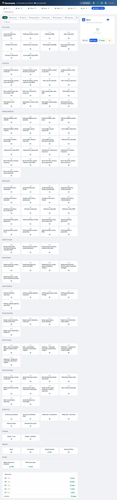
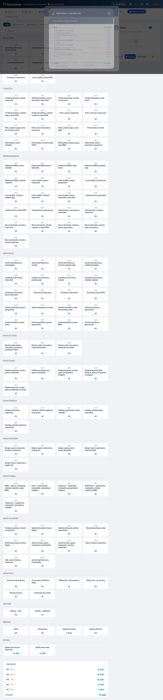
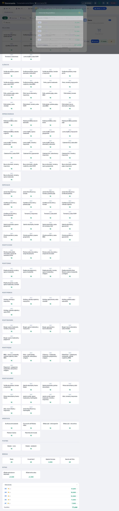
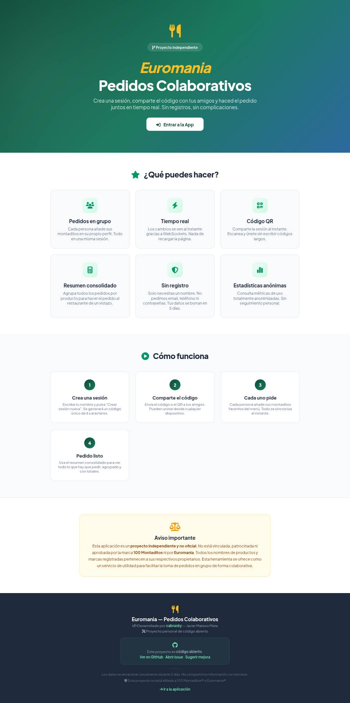

<p align="center">
  
</p>

<h1 align="center">🍔 Euromania — Pedidos Colaborativos</h1>

<p align="center">
  <strong>Aplicación web para hacer pedidos en grupo en tiempo real.</strong><br>
  Crea una sesión, comparte el código QR con tus amigos y haced el pedido juntos.<br>
  Sin registros, sin complicaciones.
</p>

<p align="center">
  <a href="https://euromania.cabrasky.net/">🌐 Web</a>
  ·
  <a href="https://github.com/cabrasky/euromania-pedidos/issues">🐛 Reportar un bug</a>
  ·
  <a href="https://github.com/cabrasky/euromania-pedidos/issues/new?template=feature_request.md">✨ Sugerir mejora</a>
</p>

<p align="center">
  
  
  
  
  
  
</p>

---

## 📸 Capturas

<p align="center">
  
  
  <br>
  
  
</p>

---

## ✨ Características

| Característica | Descripción |
|---|---|
| 🧑‍🤝‍🧑 **Pedidos en grupo** | Cada persona añade sus montaditos en su propio perfil. Todo en una misma sesión. |
| ⚡ **Tiempo real** | Los cambios se ven al instante gracias a WebSockets. Nada de recargar la página. |
| 📱 **Responsive** | Layout de escritorio con sidebar completa y móvil con FAB + overlay a pantalla completa. |
| 📋 **Resumen consolidado** | Agrupa todos los pedidos por producto para hacer el pedido al restaurante de un vistazo. |
| 🧾 **Historial de comandas** | Cada "Hacer pedido" guarda el snapshot de la ronda. Historial expandible con totales y quién pagó. |
| 💰 **Splitwise / Liquidación** | Modal con desglose por persona y liquidación sugerida basada en quién pagó cada ronda. Copia resumen o CSV. |
| 🪄 **Sin registro** | Solo necesitas un nombre. No pedimos email, teléfono ni contraseñas. |
| 📊 **Estadísticas anónimas** | Panel admin con métricas de uso totalmente anonimizadas. |
| 🌐 **SSR (Server-Side Rendering)** | SEO optimizado con renderizado en servidor Node.js. |
| 🔒 **Seguridad** | Rate limiting, IP blocking, Let's Encrypt SSL, WebSocket limits. |

## 🚀 Stack técnico

| Capa | Tecnología |
|---|---|
| **Frontend** | React 18 + TypeScript + Vite 6 |
| **Backend** | FastAPI (Python 3.11) + asyncpg |
| **SSR** | Node.js Express con React 18 server-side |
| **Base de datos** | PostgreSQL 16 |
| **Tiempo real** | WebSockets (FastAPI nativo) |
| **Proxy** | nginx + Let's Encrypt SSL |
| **Host** | Servidor Linux, systemd |

## 📦 Estructura del proyecto

```
euromania-pedidos/
├── frontend/
│   ├── src/
│   │   ├── components/
│   │   │   ├── modals/
│   │   │   │   ├── OrderViewModal.tsx      # Vista por persona / consolidada
│   │   │   │   ├── OrderHistoryModal.tsx   # Historial de comandas
│   │   │   │   ├── SplitwiseModal.tsx      # Liquidación de cuentas
│   │   │   │   ├── QRModal.tsx             # Código QR para compartir
│   │   │   │   └── PrivacyModal.tsx        # Aviso legal / privacidad
│   │   │   ├── OrderPanel.tsx              # Sidebar / FAB overlay
│   │   │   ├── HistoryPanel.tsx            # Historial inline (escritorio)
│   │   │   ├── Header.tsx, PersonBar.tsx, MenuGrid.tsx
│   │   │   └── ui/                         # Componentes reutilizables
│   │   ├── pages/OrderPage.tsx             # Página principal de pedidos
│   │   ├── services/api.ts, websocket.ts, menuStore.ts
│   │   ├── data/menuData.ts                # Menú estático fallback
│   │   └── styles/shared.css               # Todo el CSS
│   ├── public/landing.html                 # Landing page SEO
│   └── package.json
├── server.py                               # FastAPI + WebSockets
├── ssr-server.mjs                          # Node SSR server
├── requirements.txt
└── deploy.sh / apply-schedule.py           # Scripts de despliegue
```

## 🧠 Cómo funciona

1. **Crea una sesión** — Entra en la app, pon tu nombre y crea una sesión. Se genera un código único de 6 caracteres.
2. **Comparte el código** — Envía el código o escanea el QR con el móvil. Todos se conectan a la misma sesión.
3. **Cada uno pide** — Cada persona añade sus productos desde el menú. Los cambios se ven al instante en todos los dispositivos.
4. **Revisa y pide** — Usa el resumen por persona o consolidado para ver el pedido completo. Haz "Pedido" para guardar la ronda.
5. **Liquida** — Usa el modal Splitwise para calcular quién debe a quién según quién pagó cada ronda.

## 🐳 Despliegue

### Requisitos

- Python 3.11+
- Node.js 18+
- PostgreSQL 16

### Instalación

```bash
# Backend
pip install -r requirements.txt
python server.py

# Frontend (desarrollo)
cd frontend
npm install
npm run dev

# Frontend (producción)
npm run build
node ../ssr-server.mjs
```

### Variables de entorno

| Variable | Descripción | Defecto |
|---|---|---|
| `EUROMANIA_DB` | DSN de PostgreSQL | `postgresql://euromania@localhost:5432/euromania` |
| `EUROMANIA_HOST` | Host del servidor | `0.0.0.0` |
| `EUROMANIA_PORT` | Puerto del servidor | `8112` |
| `EUROMANIA_MAX_RPM` | Límite de req/min por IP | `120` |
| `EUROMANIA_SESSION_TTL` | Tiempo de vida sesión inactiva (s) | `86400` (24h) |
| `EUROMANIA_SESSION_MAX_AGE` | Tiempo máximo de sesión (s) | `432000` (5 días) |
| `EUROMANIA_ADMIN_PASSWORD` | Contraseña panel admin | (generada) |
| `EUROMANIA_TRUSTED_PROXIES` | CIDRs de proxies confiables | `192.168.0.0/16,...` |

## 🤝 Contribuciones

Las contribuciones son bienvenidas. Este es un proyecto personal, pero si tienes ideas, bugs o mejoras:

1. Abre un [issue](https://github.com/cabrasky/euromania-pedidos/issues/new)
2. Haz un fork y envía un PR
3. O simplemente [escribe un mensaje](https://github.com/cabrasky)

## 📄 Licencia

MIT — Ver el archivo [LICENSE](LICENSE) para más detalles.

---

<p align="center">
  <sub>Proyecto independiente. No afiliado a 100 Montaditos® ni Euromania®.</sub><br>
  <sub>Desarrollado por <a href="https://github.com/cabrasky">cabrasky</a> — Javier Mateos Mata</sub>
</p>
